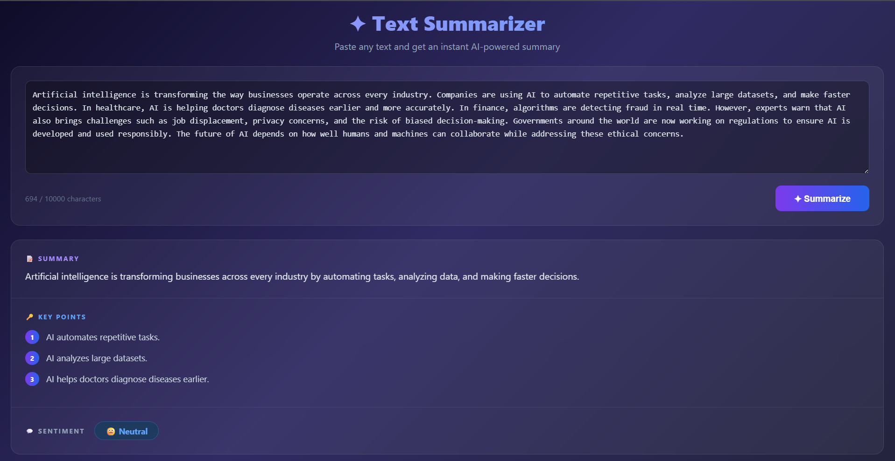

# Text Summarizer

A full-stack app that accepts unstructured text and returns a structured summary using an LLM API. Built with React + Node.js as part of an AI Developer Intern assignment.

## Tech Stack

- Frontend: React + Vite
- Backend: Node.js + Express
- LLM: Groq API (llama-3.1-8b-instant)
- Libraries: dotenv, cors, groq-sdk

## Setup

### 1. Install dependencies
```bash
cd client && npm install
cd ../server && npm install
```

### 2. Configure API key

Get a free API key from https://console.groq.com/keys
```bash
# On Windows:
copy server\.env.example server\.env

# On Mac/Linux:
cp server/.env.example server/.env
```

Then open server/.env and add your Groq API key:
```
GROQ_API_KEY=your-key-here
```

### 3. Run the app
```bash
# Terminal 1 - start the backend
cd server && node src/index.js

# Terminal 2 - start the frontend
cd client && npm run dev
```

Open http://localhost:5173 in your browser.

## Why Groq?

Groq provides a completely free API tier with no credit card required. It is fast, reliable, and uses the same interface as the OpenAI SDK, making it straightforward to integrate. The llama-3.1-8b-instant model follows structured JSON instructions reliably and responds quickly, which is ideal for this use case.

## Prompt Design

The prompt does four things intentionally:

1. **Sets a strict role** — "information extractor" primes the model for precision over creativity
2. **Shows the exact JSON shape** — models mirror examples reliably, reducing hallucinated key names
3. **Enumerates allowed sentiment values** — prevents the model inventing labels like "mostly positive" or "mixed"
4. **Explicitly forbids markdown** — stops the model wrapping JSON in code fences which would break JSON.parse()

Temperature is set to 0.2 to reduce variance and produce more consistent structured output.

## Error Handling

- Empty or too-short input is rejected before calling the API
- Missing API key causes the server to exit with a clear message
- Invalid JSON from the model is caught and reported cleanly
- Frontend shows friendly error messages for all failure cases

## Trade-offs & Shortcuts

- No authentication — not needed for a single-user local tool
- No database — results are not persisted, out of scope
- Minimal UI — deliberate choice to focus on LLM integration quality
- No test suite — would add with more time, starting with validate.js
- Single endpoint — kept simple instead of over-engineering services

## What I'd Add With More Time

- File upload support (drag and drop a .txt or .pdf)
- Batch processing of multiple inputs
- Unit tests for validate.js and JSON parsing logic
- Schema customisation via a config flag
- Confidence flag if the model sentiment score is near a boundary

## Example Output



